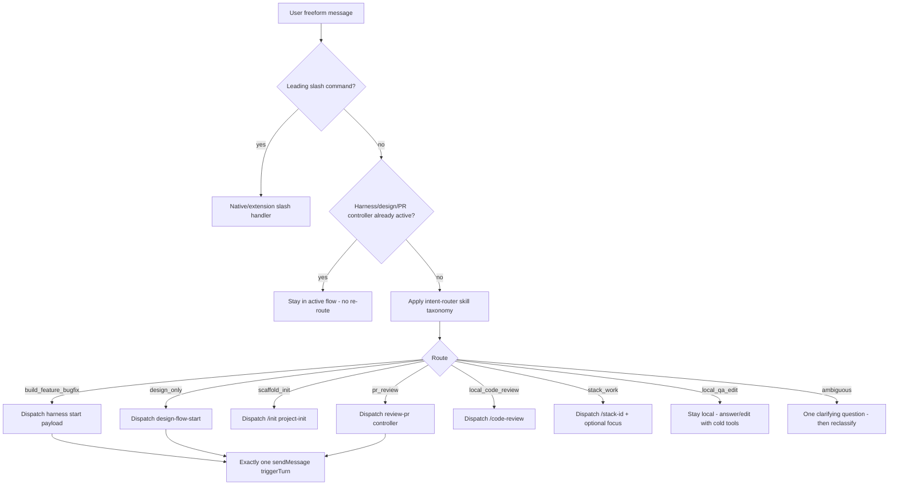
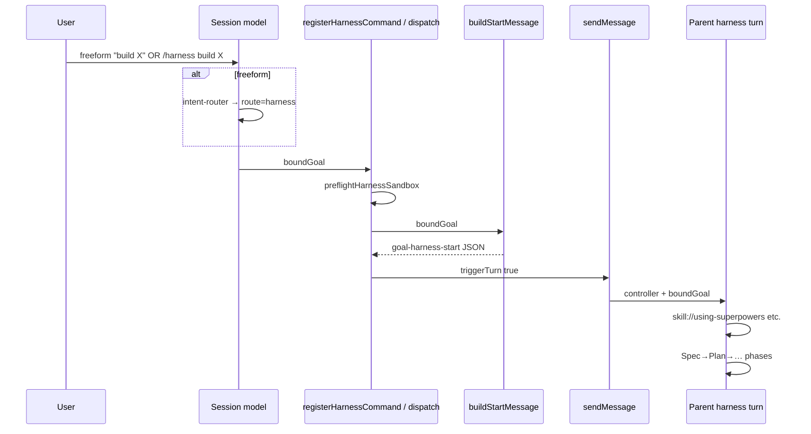

# OMP cold-start + intent router redesign

**Date:** 2026-07-31  
**Status:** Design (Spec gate)  
**Beads:** epic `dotfiles-3v6` · phase `dotfiles-7e9`  
**SoT tree:** `omp/` (linked to `~/.omp/agent` via `omp/link.sh`)  
**Bound goal:** lean cold start; freeform intent routes into thin slash/flow loaders; remove caveman; keep Superpowers off cold path.

This document is the Spec gate artifact. Plan-writer must be able to implement from this file alone.

---

## 1. Problem

OMP cold start currently injects a large skill catalog, Superpowers workflow set, caveman, stack routers, and fat AGENTS catalog text before the user has stated intent. Token cost is paid on every session whether the turn is a one-line Q&A or a full harness run.

Slash flows already exist as mostly-thin loaders (`/init`, `/design`, stack shells) or extension-registered commands (`/harness`, `/review-pr`), but freeform prompts have no first-class router: the default model is expected to already "know" the heavy catalog.

### 1.1 Goals

1. **Measurably smaller cold catalog** — zero Superpowers names, zero caveman, zero stack pack entry skills in `skills.includeSkills`.
2. **Intent-first freeform path** — first model turn can classify user intent and dispatch into existing flows without the user typing a slash.
3. **Thin slash shells** — `/harness`, `/init`, `/design`, `/review-pr`, optional `/code-review`, `/stack-*`, `/mcp-stack` load skills/agents only when invoked.
4. **On-demand activation** — Superpowers, domain packs, ponytail, design-flow, goal-harness skills load inside the chosen flow (live `skill://` / absolute path), not at session open.
5. **Caveman fully removed** from required cold and role surfaces (ponytail stays, on-demand).
6. **Boring mechanisms** — reuse `ExtensionAPI.registerCommand` + `sendMessage` start payloads; no parallel orchestrator, no shadow of native `/goal` or `/guided-goal`.

### 1.2 Non-goals

- Rewriting WF7 PR-review internals beyond slash shell + intent route.
- Removing ponytail (only caveman is deleted).
- Changing native `/goal` / `/guided-goal`.
- Pi removal or OMP binary changes outside agent config/extensions in this tree.
- Implementing a full GCP skill pack in this phase (extension point only).
- Distilling android pack for GCP bleed in this phase (documented follow-up).
- Auto-starting `/harness` from `/design` handoff.
- New MCP servers beyond enabling already-defined headroom/context-mode cold.

---

## 2. Resolved decisions

Every open item from research is closed here. Plan must not re-litigate without a Spec revision.

| ID | Decision | Choice | Rationale |
|----|----------|--------|-----------|
| D1 | Cold MCP set | **Enable** `tokensave`, `headroom`, `context-mode`. Keep `context7` `enabled: false` (opt-in via `/mcp enable` or `/mcp-stack`). RTK remains shell/hooks, not MCP. | Matches user "only things loaded initially" list; context7 is docs-scout primary and still optional to keep xd:// smaller. |
| D2 | Intent mechanism | **Thin cold session contract** in `omp/AGENTS.md` + cold skill `intent-router` + agent file `omp/agents/intent-router.md`. Default session model classifies freeform turns. Discrete agent spawn is optional for ambiguity only — not required every turn. **No** pre-model extension hook intercepting all messages. | YAGNI; matches existing "skill + agent md + slash sendMessage" patterns; avoids invasive session middleware. |
| D3 | Cold `includeSkills` | **Exactly:** `intent-router`, `beads`. Nothing else. | Near-empty cold path; beads keeps durable-task vocabulary available without Superpowers. |
| D4 | Cold `stack-*` routers | **Remove** from cold `includeSkills`. Keep `commands/stack-*.md` + `skills/stack-*/SKILL.md` on disk for on-demand `/stack-*` and intent dispatch. | Stack activation is a flow, not a cold tax. |
| D5 | Slash surface | Keep: `/harness`, `/init`, `/design`, `/review-pr`, `/stack-rust`, `/stack-ios`, `/stack-android`, `/mcp-stack`. **Add** thin `/code-review` for local/milestone-style `code-reviewer` (not WF7). **Add** optional thin `commands/harness.md` documentation shell that does not double-register. Prune nothing else required. | Covers bound goal commands; code-review maps cleanly without inventing WF7. |
| D6 | GCP pack | **Defer implementation.** Document `DomainPackId` extension point + future `/stack-gcp` shell in domain-packs. No pack root, no skills, no cold refs this phase. | YAGNI; google/skills not wired. |
| D7 | Android GCP distill | **Follow-up** (out of scope). Note only: audit android entry/include globs for cloud/GCP bleed when GCP pack lands. | Not needed for cold-start win. |
| D8 | Freeform → harness without double-start | Intent dispatch **reuses the same start builders** as slash handlers (`buildStartMessage` / `handleHarnessCommand`, `buildDesignStartMessage`, `buildReviewPrControllerMessage`). Prefer **one** `sendMessage(..., { triggerTurn: true })` path. Session rule: if a harness/design/pr-review controller turn is already active, freeform stays in that flow (no second start). | Prevents double harness; boring reuse. |
| D9 | Cold AGENTS.md size | **Replace** fat catalog bullets with a short intent-routing contract + tool/MCP pointers + "flows load skills". Target: keep `omp/AGENTS.md` OMP-delta only, roughly ≤ half current length; no Superpowers skill laundry lists. | Cold tokens; shared policy stays in `agent-stack/`. |
| D10 | Ponytail | **Keep** skill roots resolvable; **not** in cold `includeSkills`. Load on implementer/task-review/design writers via role maps and live `skill://`. | User killed caveman only. |
| D11 | Superpowers cold | **None** in cold `includeSkills`. Parent/flow loads `using-superpowers` first via live read when `/harness` or `/design` starts. | Bound goal. |
| D12 | Caveman | **Full removal** from config, role maps, agents, templates, pack overlays, docs. Remove caveman `customDirectories` entry entirely. | Bound goal. |

---

## 3. Architecture

### 3.1 Two session modes

```text
┌─────────────────────────────────────────────────────────────┐
│ COLD SESSION (every omp start)                              │
│  - config.yml: includeSkills = [intent-router, beads]       │
│  - customDirectories: superpowers + agents + omp skills +   │
│      pack roots (resolve only; not catalogued cold)         │
│  - MCP: tokensave, headroom, context-mode ON; context7 OFF  │
│  - AGENTS.md: short intent contract + tool pointers         │
│  - Default model = freeform classifier / local worker       │
└───────────────────────────┬─────────────────────────────────┘
                            │
          freeform user message (no leading slash)
                            │
                            ▼
                 ┌──────────────────────┐
                 │ Intent classification│
                 │ (skill://intent-router)│
                 └──────────┬───────────┘
                            │
        ┌───────┬───────┬───┴────┬──────────┬──────────┐
        ▼       ▼       ▼        ▼          ▼          ▼
     harness  design   init   review-pr  stack-*    stay-local
        │       │       │        │          │          │
        └───────┴───────┴────┬───┴──────────┘          │
                             ▼                         ▼
                    ON-DEMAND FLOW                minimal tools
                 (load skills/agents/             tokensave, rtk,
                  MCP as that flow needs)         headroom, ctx-mode
```

### 3.2 Cold vs on-demand

| Layer | Cold | On-demand (per flow) |
|-------|------|----------------------|
| Skills catalog | `intent-router`, `beads` | Superpowers set, `goal-harness`, `design-flow`, `ponytail`(+review/audit), stack entry skills, role skills via `REQUIRED_SKILLS_BY_ROLE` |
| customDirectories | Keep resolve roots (minus caveman) | N/A (already on disk) |
| MCP | tokensave, headroom, context-mode | context7 via `/mcp enable` / `/mcp-stack` |
| Agents | intent-router md available; harness/design/pr agents not spawned | Spawned by flow controllers |
| Slash commands | Registered/available as empty/thin shells | Handler loads flow |

### 3.3 Control flow — freeform intent



### 3.4 Control flow — explicit slash

Unchanged pattern:

1. User types `/harness …` / `/design …` / etc.
2. Command handler parses args, preflights if needed.
3. Builds start payload (JSON or controller protocol text).
4. `api.sendMessage(payload, { triggerTurn: true })` (or design/init equivalent).
5. Next turn runs flow parent with flow-specific skill loads.

Intent path must call the **same builders** the slash handlers use so behavior stays single-sourced.

---

## 4. Intent agent / skill

### 4.1 Names and paths

| Artifact | Path | Cold? |
|----------|------|-------|
| Skill | `omp/skills/intent-router/SKILL.md` | **Yes** — only flow skill in `includeSkills` with `beads` |
| Agent | `omp/agents/intent-router.md` | Available; spawn optional |
| Session contract | section in `omp/AGENTS.md` | Always loaded with agent dir |

### 4.2 When it runs

1. **Default (primary):** every freeform user turn in a cold or non-controller session — the **session default model** follows `skill://intent-router` + AGENTS contract and either stays local or dispatches once.
2. **Optional spawn:** if the turn is long/ambiguous or the parent is a thin router session that prefers structured JSON only, spawn agent `intent-router` with tools `[bash, read, search]` (read-only bias). Spawn is not required for happy-path short prompts.
3. **Does not run:** when user already invoked a slash flow command; when a harness/design/PR controller protocol turn is already bound; inside implementer lanes (those roles have their own skill maps).

### 4.3 Classification taxonomy

Stable route ids (string enums for tests and skill text):

| Route id | Meaning | Dispatch |
|----------|---------|----------|
| `harness` | Multi-step feature, bugfix-with-process, "build X", epic-shaped work | Harness start (`goal-harness-start`) with `boundGoal` = user text (trimmed) |
| `design` | Architecture / PDR / Arc42 / ADR-only, explicitly design-not-build | `design-flow-start` via `/design` builders |
| `init` | Scaffold AGENTS/CLAUDE/bd for a repo; "set up agent stack" | `/init` → `runProjectInit` |
| `review_pr` | GitHub PR review by URL / `owner/repo#n` / number | `/review-pr` controller message |
| `code_review` | Local diff / branch / milestone-style multi-angle review (no PR target) | `/code-review` → `code-reviewer` agent angles |
| `stack` | Explicit language/platform pack work ("use rust skills", iOS/Android) | `/stack-{rust,ios,android}` (+ future gcp) |
| `mcp` | Need docs MCP or explicit stack MCP enable | `/mcp-stack` or targeted `/mcp enable` |
| `local` | Q&A, small edit, explain, search, one-file fix without process ceremony | Stay in session; no flow start |
| `ambiguous` | Cannot choose with confidence | Ask **one** clarifying question; do not start harness |

**Precedence (first match wins after obvious signals):**

1. Explicit PR target shape → `review_pr`
2. Explicit "design only / PDR / Arc42 / ADR" without implement → `design`
3. Explicit scaffold/init agents → `init`
4. Explicit pack name → `stack`
5. Multi-step build/fix with verification expectation → `harness`
6. Review my diff/branch without PR → `code_review`
7. Otherwise → `local`

**Anti-patterns:**

- Do not route every coding question to `harness`.
- Do not route "what does this function do?" to `design`.
- Do not start `harness` and `design` together.
- Do not invent a second goal text; `boundGoal` is the user message (or a minimal tight paraphrase only when user message is pure meta — prefer verbatim).

### 4.4 Dispatch table (implementation contract)

Intent output (skill instructs model to produce this mentally or as a short JSON line before acting):

```json
{
  "route": "harness|design|init|review_pr|code_review|stack|mcp|local|ambiguous",
  "boundGoal": "string",
  "stackId": "rust|ios|android|null",
  "prTarget": "string|null",
  "confidence": "high|low"
}
```

| route | Action |
|-------|--------|
| `harness` | Call same path as `/harness`: `handleHarnessCommand(boundGoal)` → one `sendMessage` with `{ kind: "goal-harness-start", ... }` **or** instruct exact slash `/harness <boundGoal>` only if extension API unavailable to the model. Prefer programmatic reuse inside any future thin intent extension helper `dispatchIntent(route)` that wraps existing builders. |
| `design` | `buildDesignStartMessage(boundGoal)` → design start send **or** `/design <boundGoal>`. |
| `init` | Follow `commands/init.md` / `runProjectInit` — no Spec/Plan issues. |
| `review_pr` | Require parseable target; `buildReviewPrControllerMessage({ target, dryRun })` → sendMessage. If no target, ask once. |
| `code_review` | Load `agents/code-reviewer.md` + live skills listed there; review scope = boundGoal/diff. **Not** WF7. |
| `stack` | Invoke matching `commands/stack-*.md` instructions; load entry skills by absolute path via existing domain-packs helpers. |
| `mcp` | Point at `/mcp-stack` enable steps (context7 etc.). |
| `local` | Answer with cold tools only; may `read skill://ponytail` ad-hoc if user asks for minimal code — still not cold-listed. |
| `ambiguous` | One question; stop. |

### 4.5 Double-start guard

- Session/AGENTS rule: **at most one** of `{goal-harness-start, design-flow-start, WF7 PR REVIEW CONTROLLER}` active binding per session thread unless previous flow explicitly handed off and stopped.
- If user freeform arrives mid-harness, treat as harness steering input, not new intent route.
- Slash `/harness` while harness active: existing harness behavior applies (do not invent a second controller); intent router must not fire a parallel start.

### 4.6 Optional tiny helper (YAGNI gate)

Prefer pure skill+AGENTS first. Only if plan finds duplicated stringly dispatch in multiple places, add:

- `omp/extensions/goal-harness/intent-dispatch.ts` with pure functions:
  - `classifyIntentPreview` — **not** ML; optional keyword assist for tests only, or skip entirely and keep classification LLM-side.
  - `buildDispatchPayload(route, args) -> sendMessage payload` wrapping existing builders.

**Default:** no classifier code; LLM classification + builder reuse. Tests assert builders and cold allowlists, not NLP.

---

## 5. Exact cold allowlists

### 5.1 `omp/config.yml` → `skills.includeSkills`

```yaml
includeSkills:
  - intent-router
  - beads
```

**Forbidden in cold includeSkills (non-exhaustive but tested):**

- All Superpowers workflow names currently listed (`using-superpowers`, `brainstorming`, `writing-plans`, `requesting-code-review`, `receiving-code-review`, `systematic-debugging`, `test-driven-development`, `subagent-driven-development`, `using-git-worktrees`, `verification-before-completion`, `finishing-a-development-branch`, `dispatching-parallel-agents`, `executing-plans`, …)
- `goal-harness`, `design-flow`
- `caveman`, `caveman-*`, `cavecrew`
- `ponytail`, `ponytail-*` (on-demand only)
- `stack-rust`, `stack-ios`, `stack-android`
- Domain pack skill directory names / globs (`rust-*`, `axiom-*`, android entry skills, etc.) — still covered by `DOMAIN_COLD_START_FORBIDDEN_GLOBS`

### 5.2 `skills.customDirectories`

**Keep (resolve roots, not cold catalog):**

```yaml
customDirectories:
  - ~/.agents/skills/superpowers
  - ~/.agents/skills
  - ~/.omp/agent/skills
  - ~/.claude/plugins/marketplaces/rust-skills/skills
  - ~/.claude/plugins/marketplaces/axiom-marketplace/axiom-codex/skills
```

**Remove entirely:**

```yaml
# DELETE
- ~/.claude/plugins/marketplaces/caveman/skills
```

Notes:

- Superpowers root stays so `/harness` / `/design` live `skill://using-superpowers` resolves.
- Pack roots stay so `/stack-*` and `resolvePackRoots` work.
- `~/.agents/skills` stays for ponytail + android-local skills without cold listing.

### 5.3 `omp/mcp.json`

```json
{
  "mcpServers": {
    "tokensave": { "command": "tokensave", "args": ["serve"] },
    "headroom": {
      "enabled": true,
      "command": "headroom",
      "args": ["mcp", "serve"]
    },
    "context-mode": {
      "enabled": true,
      "command": "context-mode"
    },
    "context7": {
      "enabled": false,
      "url": "https://mcp.context7.com/mcp"
    }
  },
  "disabledServers": [ /* unchanged blocklist */ ]
}
```

- RTK: no MCP entry; shell + hooks per `RTK.md`.
- `/mcp-stack` docs update: cold already has tokensave+headroom+context-mode; command focuses on **context7** (and any future opt-in).

### 5.4 Cold AGENTS.md strategy (`omp/AGENTS.md`)

Rewrite OMP-only deltas to roughly:

1. Binary/launch/link one-liners (keep).
2. Model-router / gate budget pointers (keep short).
3. **Intent routing** — taxonomy summary + "freeform → intent-router → one dispatch; slash bypasses".
4. **Cold tools** — tokensave, headroom, context-mode, rtk, bd, beads skill; context7 opt-in.
5. **Flows load skills** — table pointing at `/harness`, `/design`, `/init`, `/review-pr`, `/code-review`, `/stack-*` without listing every Superpowers name.
6. Remove: caveman mentions; "ultra-core Superpowers + caveman/ponytail roots + stack routers" cold catalog claim; any implication Superpowers is cold-loaded.

Shared cross-agent policy remains `../agent-stack/` — do not duplicate.

Target size: prefer **well under ~2KB** of unique OMP delta; no skill body vendoring.

---

## 6. Slash command shells inventory

| Command | Mechanism today | Target | Loads when invoked |
|---------|-----------------|--------|--------------------|
| `/harness` | `registerHarnessCommand` in `extensions/goal-harness/index.ts` | Keep extension registration. **Add** optional thin `omp/commands/harness.md` that documents behavior and says "extension-registered; do not duplicate registerCommand". Shell must not call start twice. | `using-superpowers` → `goal-harness` → `requesting-code-review`; then phase roles via `REQUIRED_SKILLS_BY_ROLE` |
| `/init` | `omp/commands/init.md` | Keep thin; ensure no Superpowers cold assumption | `runProjectInit` / `project-init` agent; ponytail by name if needed; **no caveman** |
| `/design` | `omp/commands/design.md` | Keep thin | `using-superpowers`, `design-flow`, `brainstorming` (as today) |
| `/review-pr` | `registerReviewPrCommand` | Keep name **`review-pr`**; optional thin `commands/review-pr.md` doc shell if useful for discoverability | WF7 agents/protocol unchanged |
| `/code-review` | **missing** | **Add** `omp/commands/code-review.md` thin shell | `agents/code-reviewer.md` + `requesting-code-review`, `ponytail-review`, optional `ponytail-audit`, stack as needed. Output JSON per agent. Not WF7. |
| `/stack-rust` | `commands/stack-rust.md` | Keep; fix text that says "router always cold-listed" → on-demand | `skill://stack-rust` + pack entry paths |
| `/stack-ios` | same | same | axiom entry skills |
| `/stack-android` | same | same | android entry skills |
| `/stack-gcp` | none | **Not created this phase** — document future shell only | — |
| `/mcp-stack` | `commands/mcp-stack.md` | Update for new cold MCP set | Enables context7 (primary); mentions headroom/context-mode already cold |
| `/goal`, `/guided-goal` | native OMP | **Do not register/shadow** | native |

### 6.1 `commands/harness.md` (optional thin doc shell)

If OMP loads `commands/*.md` as user-visible commands **in addition to** extension `registerCommand("harness")`, adding `harness.md` could double-bind. 

**Rule:** create `harness.md` only if the platform treats markdown commands and extension commands as a single namespace merge where extension handler wins, **or** if the md file is documentation-only and not executed. Plan-writer must verify against OMP 17.2 command merge behavior in `compatibility.json` / existing tests (`harness-command.test.ts` expects sole registration of `harness` from extension).

**Default recommendation:** ship extension-only `/harness` (status quo registration) + intent dispatch to the same handler path; **skip** `harness.md` unless discoverability requires a stub that clearly defers to the extension without a second handler.

### 6.2 `/code-review` vs `/review-pr`

| | `/review-pr` | `/code-review` |
|--|--------------|----------------|
| Target | GitHub PR | Working tree / branch / paths in `$ARGUMENTS` |
| Protocol | WF7 controller text | `code-reviewer` agent + REVIEW-POLICY |
| Skills | WF7 agent defs | requesting-code-review, ponytail-review/audit |
| Intent route | `review_pr` | `code_review` |

Do not merge them.

---

## 7. Caveman full removal plan

### 7.1 Delete / scrub surfaces

| Area | Files / symbols | Action |
|------|-----------------|--------|
| Config | `omp/config.yml` `includeSkills` + `customDirectories` | Remove `caveman` name and caveman marketplace directory |
| Pack overlays | `omp/configs/pack-rust.yml`, `pack-ios.yml`, `pack-android.yml` | Remove `caveman`, `caveman-*`, `cavecrew` from include lists |
| Role map | `REQUIRED_SKILLS_BY_ROLE` in `extensions/goal-harness/skills.ts` | Drop `"caveman"` from `spec-producer`, `plan-producer`, `bitesize-producer`, `implementer`, `task-fixer` |
| Harness skill default goal | `omp/skills/goal-harness/SKILL.md` line mandating caveman | Rewrite mandate: Superpowers + stack + **ponytail** only |
| Design skill | `omp/skills/design-flow/SKILL.md` | Remove caveman from writers list |
| Design manifest | `omp/agents/design-manifest.json` `requiredSkills` | Remove caveman from pdr/arc42/adr writers |
| Agents | `spec-writer.md`, `implementer.md`, `pdr-writer.md`, `arc42-writer.md`, `adr-writer.md`, `project-init.md` | Remove caveman name-drops; keep ponytail where relevant |
| project-init | `extensions/goal-harness/project-init.ts` AGENTS template string | Remove caveman from Prefer/tools lists |
| Templates | `templates/project/AGENTS.md.tmpl`, `subdir-AGENTS.md.tmpl` | Remove caveman rows; keep ponytail |
| Docs | `omp/AGENTS.md`, `omp/README.md` | Rewrite cold catalog; no caveman |
| Fixtures | any harness-project AGENTS mentioning caveman as required | Align with templates |
| agent-stack global docs | only if they **require** caveman for OMP cold | Out of band unless OMP tests fail; this design's SoT is `omp/` — do not expand to full dotfiles caveman purge unless linked assertions demand it |

### 7.2 Tests

| Test | Change |
|------|--------|
| `tests/lean-config.test.ts` | customDirectories must **not** require caveman fragment; includeSkills required set becomes `intent-router`, `beads` only; forbidden list includes all former superpowers cold names + caveman + stack routers |
| `tests/skill-loading.test.ts` | role rows no longer expect caveman; keep multi-root resolve tests but retarget fixtures away from caveman-only assumptions if any |
| Pack overlay tests (if any assert caveman globs) | drop caveman globs |
| entry-assets / smoke scripts grepping caveman as required | update |

### 7.3 What stays

- Ponytail skill + review/audit.
- Any historical git history (no rewrite).
- Generic multi-root skill resolution tests (rename comments from "caveman duplicate" to "multi-root").

---

## 8. Superpowers load-on-flow

Cold: **no** Superpowers skill names in `includeSkills`.

| Flow / role | Loads (live `skill://` or harness resolve) | Order / notes |
|-------------|-----------------------------------------------|---------------|
| `/harness` parent | `using-superpowers`, `goal-harness`, `requesting-code-review` | Matches `buildStartMessage` controllerPolicy + `REQUIRED_SKILLS_BY_ROLE["parent-orchestrator"]` |
| Spec producer | `brainstorming`, `receiving-code-review`, `ponytail` | caveman removed |
| Plan / BiteSize producers | `writing-plans`, `receiving-code-review`, `ponytail` | + parity manifest |
| Implementation organizer | `subagent-driven-development`, `using-git-worktrees`, `requesting-code-review` | |
| Implementer / task-fixer | SDD, TDD, `receiving-code-review`, `ponytail` + automatic stack skills | caveman removed |
| Bug producer/fixer | `systematic-debugging`, TDD, `receiving-code-review` | |
| Task reviewer | `ponytail-review`, `ponytail-audit` + parity `code-reviewer` | forbid receiving-code-review |
| Milestone organizer | `requesting-code-review`, `verification-before-completion` | |
| PR agent | `finishing-a-development-branch` | |
| `/design` parent | `using-superpowers`, `design-flow`, `brainstorming` | per `commands/design.md` / `buildDesignStartMessage` |
| Design writers | brainstorming + ponytail (manifest) | no caveman |
| `/init` | project-init path; no Superpowers required | beads via safe bd init only |
| `/code-review` | requesting-code-review, ponytail-review(+audit) | |
| `/review-pr` | WF7 agent skills as today | |
| stay-local | none required | may ad-hoc read skills |

`harnessReadSkill` / skill-guard attestation behavior unchanged: names + paths + hashes only; never vendor Superpowers bodies into OMP.

---

## 9. Domain packs

### 9.1 Keep on-demand (unchanged shape)

`DomainPackId = "rust" | "ios" | "android"` in `extensions/goal-harness/domain-packs.ts`.

- Cold forbidden globs remain `DOMAIN_COLD_START_FORBIDDEN_GLOBS`.
- Entry skills still resolved by absolute path on `/stack-*` or stack-scout/implementer markers.
- Thin routers `skills/stack-*/SKILL.md` + `commands/stack-*.md` stay; **not** cold-listed.

### 9.2 GCP pack approach (defer)

Document extension point only:

```ts
// Future — not implemented this phase
// export type DomainPackId = "rust" | "ios" | "android" | "gcp";
// DOMAIN_PACKS.gcp = {
//   id: "gcp",
//   stackLabels: ["gcp", "google-cloud"],
//   rootFragments: ["/* path to google/skills or vendored pack */"],
//   entrySkills: [/* router skill names */],
//   includeGlobs: ["gcp-*", ...],
// };
```

- No `commands/stack-gcp.md` until pack roots exist.
- Reference for later research: https://github.com/google/skills
- Intent taxonomy may mention `stackId: gcp` as reserved but must map to `ambiguous` or explain "pack not installed" until implemented.

### 9.3 Android distill note (follow-up)

When GCP pack is added, audit `DOMAIN_PACKS.android.includeGlobs` / entry skills for cloud-only or GCP-overlapping skills that should move to gcp pack or be dual-routed. **Out of scope** for cold-start phase — do not churn android globs now.

---

## 10. Data / control flow diagrams

### 10.1 Harness start (slash or intent)



### 10.2 Stay-local path


---

## 11. Failure modes

| Failure | Detection | Response |
|---------|-----------|----------|
| Ambiguous intent | Low confidence / multi-route tie | One clarifying question; no start payload |
| Wrong route (user wanted local, got harness) | User abort / complaint | Document: user can ignore start or stop; prefer conservative `local` when unsure |
| Wrong route (needed harness, stayed local) | User re-asks or types `/harness` | Slash always works; skill text says multi-step build → harness |
| Double harness start | Second `goal-harness-start` while active | Guard in AGENTS + intent skill; dispatch checks "controller active" if implementable; else skill forbids |
| Intent dispatches harness with empty goal | empty boundGoal | Reuse harness empty-args behavior (8 default quality requirements) **only** for explicit `/harness` with empty args; freeform empty should not occur — if classification yields empty, ask |
| PR route without target | `review_pr` missing target | Ask for URL / `owner/repo#n` |
| Stack pack missing on disk | `resolvePackRoots` empty | Tell user pack not installed; do not fake skills |
| context7 needed but disabled | docs question | Suggest `/mcp enable context7` or `/mcp-stack` |
| Skill resolve fails mid-flow | harness skill-guard | Existing attestation errors; do not broaden cold catalog to "fix" it |
| Caveman residual reference | tests/grep | Fail CI via lean-config + role map tests |

---

## 12. Testing strategy

No full suite run in Spec phase. Plan/Implement update:

### 12.1 Must change

| File | Assertions |
|------|------------|
| `omp/tests/lean-config.test.ts` | includeSkills == exact cold allowlist; no caveman dir; MCP enabled flags for headroom+context-mode; context7 still false; forbidden superpowers/stack/caveman names |
| `omp/tests/skill-loading.test.ts` | `REQUIRED_SKILLS_BY_ROLE` rows without caveman; parent still superpowers+goal-harness+requesting-code-review |
| `omp/tests/domain-packs.test.ts` | still forbids domain globs cold; no gcp required yet |
| Stack command markdown tests if any assert "cold-listed" routers | flip to on-demand wording |
| README/AGENTS snapshot tests if present | update |

### 12.2 Add (small)

| Test focus | Notes |
|------------|-------|
| `intent-router` skill file exists under `omp/skills/intent-router/SKILL.md` | entry-assets style |
| `agents/intent-router.md` exists | |
| `commands/code-review.md` exists and does not reference WF7 | |
| Dispatch builder reuse unit test | If `intent-dispatch.ts` added: harness/design/pr payloads match slash builders. If not added: skip NLP tests |
| Grep test: no `caveman` in `config.yml`, `REQUIRED_SKILLS_BY_ROLE`, design-manifest requiredSkills | cheap regression |

### 12.3 Do not

- Add ML/classifier accuracy suites.
- Full browser e2e of OMP TUI in this redesign unless already standard smoke.
- Expand WF7 fixture surface.

### 12.4 Existing harness tests

Keep: `harness-command.test.ts` (registers only `harness`), stage3/4 native goal unshadowed, pr-review-command tests, design-flow tests. Adjust only where cold catalog or caveman assumptions break them.

---

## 13. Migration / rollout

1. **Land design** (this file) → Spec approve.
2. **Plan** bite-sized: (a) caveman purge + role maps, (b) cold config+MCP+lean-config tests, (c) intent-router skill/agent + AGENTS rewrite, (d) code-review command + stack/mcp-stack doc fixes, (e) README.
3. **Implement on branch/worktree** via harness after approve — do not edit cold config half-way on main without tests.
4. **Link:** `omp/link.sh` as usual; no auth/session wipe.
5. **Existing sessions:** old sessions keep prior in-memory skill catalog until restart; users restart `omp` to pick lean cold config.
6. **Pack overlay configs** (`configs/pack-*.yml`): still valid for full-pack sessions; strip caveman globs so overlays do not reintroduce removed skill.
7. **User muscle memory:** `/harness` `/design` `/init` `/review-pr` unchanged names; freeform gains router; caveman `/caveman` no longer expected in OMP flows.
8. **Rollback:** revert `config.yml` includeSkills + mcp enabled flags + AGENTS.md; caveman dir can be re-added but is not desired.

---

## 14. Acceptance criteria (checkable)

1. `omp/config.yml` `skills.includeSkills` is exactly `intent-router`, `beads` (order flexible).
2. `omp/config.yml` has **no** caveman customDirectory and **no** caveman/superpowers-workflow/stack-* names in includeSkills.
3. `omp/mcp.json`: tokensave, headroom, context-mode enabled; context7 disabled; disabledServers blocklist preserved.
4. `omp/skills/intent-router/SKILL.md` exists with taxonomy + dispatch table aligned to §4.
5. `omp/agents/intent-router.md` exists (thin role prompt).
6. `omp/AGENTS.md` documents freeform → intent routes and does not claim Superpowers/caveman/stack routers are cold-loaded.
7. `omp/commands/code-review.md` exists; maps to `code-reviewer` not WF7.
8. `/review-pr` remains the PR review slash (extension).
9. `/harness` still registered only from goal-harness extension; native `/goal` unshadowed (existing tests stay green).
10. `REQUIRED_SKILLS_BY_ROLE` and design-manifest contain **zero** `caveman` entries; ponytail retained where previously paired.
11. Pack ymls and project templates contain zero required caveman references.
12. `lean-config.test.ts` (updated) passes for new cold allowlist + MCP flags.
13. Domain packs remain rust/ios/android only; GCP documented as deferred extension point in domain-packs comment or README — no fake pack.
14. Superpowers skills still resolve on-demand from `~/.agents/skills/superpowers` when flows load them.
15. No implementation leaves `TODO: implement` stubs for intent dispatch paths described as required (skill+AGENTS sufficient; optional helper only if chosen).

---

## 15. Out of scope / follow-ups

- GCP domain pack + `/stack-gcp` + google/skills wiring.
- Android pack distill for GCP bleed.
- Pre-model extension hook / deterministic keyword router.
- Caveman removal from unrelated hosts outside OMP acceptance (Claude marketplace install may still exist on disk; OMP simply stops referencing it).
- Changing gate ceilings, model-router dates, WF7 judge logic, smart-approve.
- Auto chain `/design` → `/harness`.
- Shrinking shared `agent-stack/AGENTS.shared.md` caveman mentions (optional consistency pass).
- Metrics dashboard for cold token savings (manual before/after session logs sufficient).

---

## 16. Concrete file touch list (for plan-writer)

| Path | Change type |
|------|-------------|
| `omp/config.yml` | Cold skills + directories |
| `omp/mcp.json` | Enable headroom, context-mode |
| `omp/AGENTS.md` | Rewrite cold contract |
| `omp/README.md` | Cold catalog + MCP + intent docs |
| `omp/skills/intent-router/SKILL.md` | **Create** |
| `omp/agents/intent-router.md` | **Create** |
| `omp/commands/code-review.md` | **Create** |
| `omp/commands/mcp-stack.md` | Update cold MCP story |
| `omp/commands/stack-*.md` | Drop "cold-listed" claims |
| `omp/commands/init.md` / `design.md` | Minor: no caveman; confirm thin |
| `omp/extensions/goal-harness/skills.ts` | Remove caveman from roles |
| `omp/extensions/goal-harness/project-init.ts` | Template text |
| `omp/extensions/goal-harness/domain-packs.ts` | Comment GCP extension point; update file header (cold routers claim) |
| `omp/skills/goal-harness/SKILL.md` | Default goal mandate without caveman |
| `omp/skills/design-flow/SKILL.md` | Remove caveman |
| `omp/agents/design-manifest.json` | requiredSkills |
| `omp/agents/*writer*.md`, `implementer.md`, `project-init.md`, `spec-writer.md` | Scrub caveman |
| `omp/templates/project/*.tmpl` | Scrub caveman |
| `omp/configs/pack-*.yml` | Scrub caveman globs |
| `omp/tests/lean-config.test.ts` | New allowlists |
| `omp/tests/skill-loading.test.ts` | Role expectations |
| related smokes/fixtures | as needed |
| optional `omp/extensions/goal-harness/intent-dispatch.ts` | only if reuse helper needed |

**Do not touch:** native goal registration, WF7 core beyond docs, Pi internals, `auth.json`.

---

## 17. Design rationale (short)

Cold start should know **how to choose a flow**, not **contain every flow**. Intent-router + beads is enough vocabulary to route; everything else is a loader. Enabling headroom/context-mode cold matches the user's named toolkit without pulling docs MCP. Caveman removal is total in OMP-required surfaces because the bound goal deletes the product choice, not just the cold list entry. GCP and android distill wait until someone needs them — ponytail YAGNI applies to packs too.

---

## 18. Traceability

| Research open item | Section |
|--------------------|---------|
| Cold MCP | §2 D1, §5.3 |
| Intent mechanism | §2 D2, §4 |
| Cold includeSkills | §2 D3, §5.1 |
| stack-* cold vs on-demand | §2 D4, §9 |
| Slash surface | §2 D5, §6 |
| GCP | §2 D6, §9.2 |
| Android distill | §2 D7, §9.3 |
| Double-load harness | §2 D8, §4.5, §11 |
| AGENTS size | §2 D9, §5.4 |
| Caveman blast radius | §7 |
| Superpowers on-demand | §8 |
| Tests | §12 |
| Acceptance | §14 |
